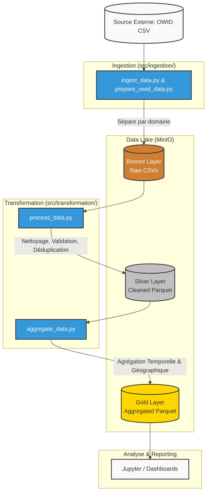

# Covid-19 Data Analysis Pipeline

Bienvenue dans le projet **Covid-19 Data Analysis**. Ce projet propose une architecture robuste de traitement de données (Big Data) basée sur PySpark et MinIO. Il extrait les données liées au Covid-19 depuis *Our World in Data (OWID)* et les traite selon l'architecture **Medallion** (Bronze → Silver → Gold).

## Architecture des Données (Medallion)

Voici le flux de données de l'ingestion à la sortie (prêt pour l'analyse) :



## Prérequis Techniques

Pour exécuter ce pipeline, vous devez disposer des éléments suivants :
- **Python 3.9+**
- **Java 11** (requis pour PySpark)
- **MinIO** ou un serveur compatible S3 en cours de fonctionnement (peut être lancé via Docker).

## Installation

Le projet utilise une architecture packagée propre. Installez le projet et ses dépendances en mode éditable avec `pip` :

```bash
git clone <votre-repo>
cd covid_data_analysis
pip install -e .
```

## Configuration

Renommez le fichier `.env-example` en `.env` (ou créez-en un) et configurez les variables nécessaires :

```env
# MinIO Configuration
MINIO_ROOT_USER=minioadmin
MINIO_ROOT_PASSWORD=minioadmin
MINIO_HOST=localhost
MINIO_PORT=9000

# Buckets
MINIO_BUCKET_BRONZE=bronze
MINIO_BUCKET_SILVER=silver
MINIO_BUCKET_GOLD=gold

# Spark Configuration
SPARK_APP_NAME="COVID-19 Analysis"

# Source de données
COVID_DATA_URL="https://covid.ourworldindata.org/data/owid-covid-data.csv"
```

## Exécution du Pipeline

Le pipeline complet peut être lancé via un seul script orchestrateur qui s'assure de l'ingestion, du nettoyage et de l'agrégation de toutes les données :

```bash
python -m src.pipeline.run_pipeline
```

Vous pouvez également vérifier que l'architecture du projet et toutes les fonctions requises sont intactes en lançant :

```bash
python -m src.pipeline.validate_pipeline
```

## 📈 Exploration et Visualisation (Dashboard Streamlit)

Une fois les données agrégées dans la couche Gold, vous pouvez explorer les résultats via un Dashboard interactif développé en Streamlit. Ce dashboard raconte l'histoire de la pandémie avec un focus particulier sur le Maroc.

Pour lancer le dashboard :
```bash
# S'assurer d'avoir installé les dépendances (pip install -r requirements.txt)
streamlit run streamlit_app/app.py
```
Le dashboard s'ouvrira automatiquement dans votre navigateur (par défaut sur `http://localhost:8501`).

## Contribution

Nous encourageons les contributions (ajout de nouvelles sources de données, de nouvelles transformations, etc.).
Veuillez consulter le fichier [CONTRIBUTING.md](CONTRIBUTING.md) pour prendre connaissance de nos directives, de la structure du code et des règles de formatage (Black/Flake8).
